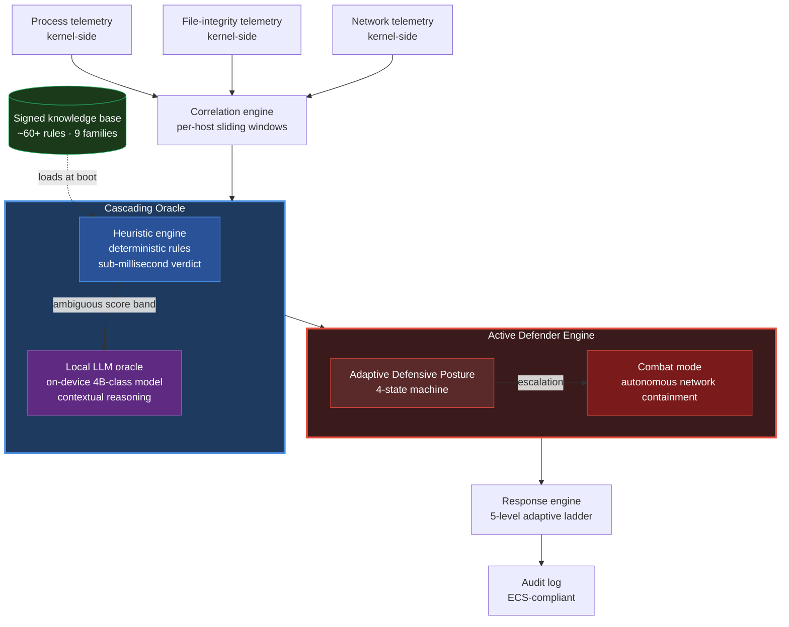

# NorthNarrow

**Sovereign EU AI-native XDR for Linux. Active Defender posture.**

*Heuristic precision meets local LLM reasoning — zero cloud dependencies, full data sovereignty, EU-built.*

---

## What is NorthNarrow

NorthNarrow is a next-generation **AI-native XDR platform** written in Rust, engineered from
the first commit for environments where data sovereignty is non-negotiable: financial
institutions, defence, healthcare, critical infrastructure, public administration, and
regulated EU markets.

It combines a deterministic rule engine with on-device LLM reasoning in a cascading
verdict pipeline, then routes the resulting verdicts through an **Active Defender** layer
that adapts the host's defensive posture in real time. The agent never phones home, never
ships telemetry off-host, and runs without an internet connection.

The project is currently **Pre-Beta**, developed in the European Union, and actively
seeking design partners willing to co-evolve detection coverage and deployment patterns
against real workloads.

---

## Key differentiators

- **Sovereign EU deployment** — built in the EU under EU law; no US/cloud telemetry path
  exists in the architecture; air-gapped operation is a first-class citizen, not a
  degraded mode.
- **AI-native architecture** — a cascading oracle pairs sub-millisecond deterministic
  rules with on-device LLM reasoning for ambiguous cases. The model runs in-process,
  inside the agent binary, with no outbound network calls.
- **Linux-first** — every detection, every response, every kernel-side hook is designed
  against the Linux threat surface as it exists today, rather than ported from a Windows
  product.
- **Adaptive Defensive Posture (industry-first)** — a four-state machine that lets the
  agent harden, observe, defend, or engage in active combat with an attacker,
  transitioning autonomously based on correlated evidence rather than waiting for a SOC
  operator.
- **Compliance-by-design** — NIS2, GDPR, DORA, the Cyber Resilience Act, and the EU AI Act
  shaped the architecture before they shaped the marketing material. See
  [`docs/COMPLIANCE.md`](docs/COMPLIANCE.md).

---

## Architecture overview

For the design reasoning behind each block, see [`docs/ARCHITECTURE.md`](docs/ARCHITECTURE.md).

---

## Tech stack

| Layer | Technology |
|---|---|
| Language | **Rust** |
| Kernel-side telemetry | **eBPF** (tracepoints, LSM-based exec & FIM hooks, kprobes) with universal userspace fallback |
| AI inference | **On-device small-LLM** (4B-class), statically linked into the agent — no external server, no `LD_LIBRARY_PATH`, no outbound API |
| Event schema | **Elastic Common Schema** |
| Cryptography | Audited Rust crypto primitives (Ed25519 signatures, SHA-256 integrity) |
| Async runtime | Tokio |
| Observability | Structured logging (`tracing`) + Prometheus metrics |
| Deployment | Single static-link binary, systemd-supervised |

Specific kernel hook names, model identifiers, and version pins are deliberately
omitted from the public surface to limit the attack-surface visible to adversaries.
Design partners receive the full technical specification under NDA.

---

## Status

**Pre-Beta.** Detection engine operational. Kernel-side telemetry stack runtime-validated.
On-device AI inference operational. Foundational layer (configuration, persistent
storage, metrics, admin CLI) production-grade. Active Defender Engine in active
development.

| Indicator | Current state |
|---|---|
| Detection rules | **~60+ curated rules across 9 detection families** |
| MITRE ATT&CK coverage | **50+ techniques mapped** |
| Test coverage | Comprehensive unit + integration suite |
| Supported OS | Linux (modern kernels); Windows planned for a future release |
| Detection latency | Sub-millisecond deterministic verdict path; AI tier on the order of seconds |
| Deployment | Single static-link binary; no separate inference server |
| Source code | Closed during Pre-Beta — open to design partners under NDA |

---

## Roadmap

The full public roadmap lives in [`docs/ROADMAP.md`](docs/ROADMAP.md). Headline trajectory:

1. **Pre-Beta hardening** — detection coverage, Active Defender Engine completion,
   anti-tamper hardening, range topology adversarial validation.
2. **Beta** — design-partner deployments on real workloads with shared
   tuning loop and incident-response feedback.
3. **v1.0** — general availability, dual-license publication (AGPLv3 + commercial),
   first paid tier sales.
4. **v1.x** — external threat-intelligence ingestion, decentralised threat-intel mesh
   (architectural design committed; see [`docs/ROADMAP.md`](docs/ROADMAP.md)).

No calendar dates are published. Operator commits to milestones in milestone order, not
in calendar order — this is a deliberate sovereignty posture against the
"ship-by-quarter-or-lose-credibility" pattern common in cloud-EDR vendors.

---

## Compliance & sovereignty

NorthNarrow's architecture was constrained from day one by the EU regulatory frontier:

| Regulation | NorthNarrow alignment |
|---|---|
| **NIS2** (Network and Information Systems Directive 2) | On-host detection + response without third-party data transfer; structured audit log compatible with incident-reporting obligations. |
| **GDPR** | No telemetry leaves the controller's perimeter; no processor relationship to declare; DPIA scope reduced to local processing only. |
| **DORA** (Digital Operational Resilience Act) | Operates fully on-host under degraded-connectivity conditions; no external dependency on the vendor for continued protection. |
| **CRA** (Cyber Resilience Act) | Single signed binary with bill-of-materials and signed update channel; designed for the CRA's secure-by-default and vulnerability-handling obligations. |
| **EU AI Act** | On-device, deterministic-by-default inference path; greedy sampling for verifiability; human-readable verdict provenance for every AI decision in the audit log. |

Full mapping in [`docs/COMPLIANCE.md`](docs/COMPLIANCE.md). Compliance attestation work
for paying tiers begins in coordination with the first design partners.

---

## For design partners

NorthNarrow is in Pre-Beta and **actively seeking design partners**. If you represent a
security team, research lab, or organisation with one of the following profiles, we want
to talk:

- Regulated EU institution (banking, insurance, healthcare, public administration, energy,
  telecommunications) preparing for NIS2 / DORA enforcement.
- Critical-infrastructure operator with sovereignty constraints that current US-centric
  EDR/XDR vendors cannot satisfy.
- Linux-heavy production environment with a real interest in autonomous active defence
  rather than alert-fatigue dashboards.
- Security research lab interested in adversarial validation of the detection + Active
  Defender pipeline against novel attack chains.

What design partners receive: early access to the agent, deep technical briefings under
NDA, direct input on detection coverage and response semantics, and acknowledgment as
co-evolution partners on the public site at GA.

What we ask in return: real workload exposure, structured detection feedback, and a
willingness to co-author incident retrospectives that improve coverage for all future
customers.

**To engage:** open a "design-partner inquiry" issue in this repository (template
available under *New Issue*). Replies are typically within a few business days.

---

## For investors

NorthNarrow is pre-revenue, pre-Beta, building toward first paid deployments in
regulated EU markets. The investment thesis rests on three asymmetric bets:

1. **EU sovereignty as a hard regulatory requirement, not a marketing wedge** — NIS2,
   DORA, CRA, and AI Act enforcement create a procurement reality in which US-centric
   cloud EDR vendors are structurally disadvantaged.
2. **Local AI inference is now economically viable** for security workloads, eliminating
   the cloud-telemetry trade-off that has been the moat of the incumbent EDR market for
   a decade.
3. **Active defence as a category** — the industry has spent fifteen years building
   alert-generation tools. The next decade is autonomous response, and the policy
   environment in the EU specifically encourages it.

For diligence materials, market-sizing memo, and founder background, open an
"investor inquiry" issue (template available under *New Issue*). Live discussions are
arranged via the channel that you prefer.

---

## For engineers

NorthNarrow is not hiring yet — the project is a single-founder effort during Pre-Beta,
by design. Hiring opens with the first paid deployments.

If you are an engineer working on systems Rust, eBPF, kernel security, or applied AI for
infosec, and you would like to be on the early-conversation list for when the team
opens: open a "general inquiry" issue with a short note about your background and what
draws you to the project. We keep track and reach out when the time is right.

---

## For press & media

For interviews, technical background briefings, or commentary on EU cybersecurity
sovereignty / NIS2 / DORA / AI Act topics: open a "press / media inquiry" issue in this
repository (template available under *New Issue*) with publication, deadline, and
angle. We aim to reply within the working day for time-sensitive requests.

---

## License

**Proprietary during Pre-Beta. All rights reserved.**

At general availability, NorthNarrow transitions to a **dual-license model**:

- **AGPLv3** for the community / Free tier
- **Commercial license** for Pro, Business, and Enterprise tiers

See [`LICENSE`](LICENSE) for the current terms and [`NOTICES.md`](NOTICES.md) for
third-party attributions (MITRE ATT&CK, SigmaHQ, and others).

---

## Contact

NorthNarrow does not yet operate a public-facing domain or staffed inbox. The only
official channels at this stage are:

- **GitHub Issues** in this repository (templated for design partners, investors,
  press, and general inquiries).
- **GitHub Discussions** in this repository (when enabled — community Q&A on
  architecture and roadmap).

A public landing page, dedicated contact addresses, and social channels will follow at
Beta. Until then, please use the issue templates — they are monitored by the founder
directly.

---

## Security

For vulnerability disclosure, please consult [`SECURITY.md`](SECURITY.md). Public issues
about security-sensitive topics should *not* be filed in the regular issue tracker.

---

## Disclaimer

NorthNarrow is **Pre-Beta software** under active development. Detection rules are
validated against published threat intelligence, but no detection system can guarantee
complete coverage of unknown threats. Use in production environments at your own risk
and always pair with defence-in-depth practices.

---

**Built in Rust. Engineered for sovereignty. Designed for the AI era.**

Made in Italy 🇮🇹 · Built for Europe 🇪🇺

