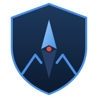
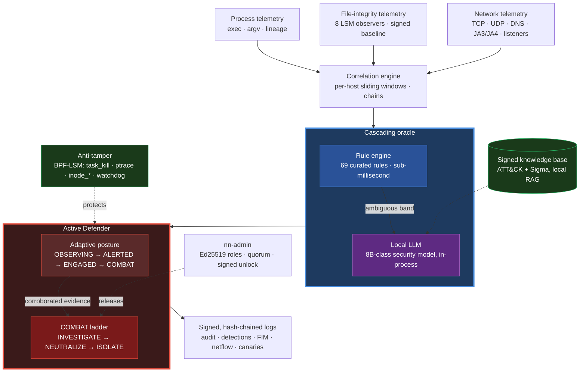

<div align="center">



# NorthNarrow

**Sovereign, AI-native XDR for Linux — written in Rust, enforced in the kernel, verified in a lab you can rerun.**

[](https://github.com/northnarrow/northnarrow-new/actions/workflows/ci.yml)
[](https://github.com/northnarrow/northnarrow-new/releases)
[](LICENSE)
[]()
[]()
[]()
[]()
[]()

*Deterministic rules decide in microseconds. A local model reasons about the ambiguous rest.<br/>
The host hardens, engages and isolates on its own — and nobody can switch it off, root included.*

[Why NorthNarrow](#why-northnarrow) ·
[How it works](#how-it-works) ·
[What is verified today](#what-is-verified-today) ·
[Quickstart](#quickstart) ·
[Supply chain](#security-and-supply-chain) ·
[Roadmap](#roadmap) ·
[Design partners](#for-design-partners)

</div>

---

## Why NorthNarrow

Most endpoint security products are a sensor that streams your telemetry to someone
else's cloud, where a model you cannot inspect decides, and an operator you do not
employ reacts hours later. For a European bank, hospital, utility or public body under
NIS2, DORA and the AI Act, that architecture is a liability before it is a product.

NorthNarrow inverts it:

| | Cloud-first EDR/XDR | **NorthNarrow** |
|---|---|---|
| Where telemetry goes | vendor cloud | **stays on the host** — no outbound path exists in the code |
| Who decides | remote models + SOC | **the agent**, in microseconds (rules) or seconds (local LLM) |
| Who responds | a human, later | **the host itself**, with a graduated ladder and a signed human override |
| Can root disable it? | usually | **no** — BPF-LSM denies signals, ptrace and file tampering, root included |
| Works air-gapped? | degraded | **first-class** |
| Trust model | "trust us" | **signed audit chain, signed release, SBOM, provenance attestation, rerunnable lab** |

---

## How it works


```mermaid
flowchart TD
    PM[Process telemetry<br/>exec · argv · lineage]
    FIM[File-integrity telemetry<br/>8 LSM observers · signed baseline]
    NET[Network telemetry<br/>TCP · UDP · DNS · JA3/JA4 · listeners]
    CE[Correlation engine<br/>per-host sliding windows · chains]

    subgraph CO["Cascading oracle"]
        HO[Rule engine<br/>69 curated rules · sub-millisecond]
        LO[Local LLM<br/>8B-class security model, in-process]
        HO -->|ambiguous band| LO
    end

    subgraph ADE["Active Defender"]
        STATE[Adaptive posture<br/>OBSERVING → ALERTED → ENGAGED → COMBAT]
        LADDER[COMBAT ladder<br/>INVESTIGATE → NEUTRALIZE → ISOLATE]
        STATE -->|corroborated evidence| LADDER
    end

    AT[Anti-tamper<br/>BPF-LSM: task_kill · ptrace · inode_* · watchdog]
    KB[(Signed knowledge base<br/>ATT&CK + Sigma, local RAG)]
    AUD[Signed, hash-chained logs<br/>audit · detections · FIM · netflow · canaries]
    ADM[nn-admin<br/>Ed25519 roles · quorum · signed unlock]

    PM --> CE
    FIM --> CE
    NET --> CE
    CE --> CO
    KB -.-> LO
    CO --> ADE
    ADE --> AUD
    AT -.protects.-> ADE
    ADM -.releases.-> LADDER

    style CO fill:#1e3a5f,stroke:#4a90e2,stroke-width:3px,color:#fff
    style HO fill:#2a5298,stroke:#4a90e2,color:#fff
    style LO fill:#5e2a82,stroke:#9b59b6,color:#fff
    style ADE fill:#3a1a1a,stroke:#e74c3c,stroke-width:3px,color:#fff
    style STATE fill:#5a2a2a,stroke:#e74c3c,color:#fff
    style LADDER fill:#7a1a1a,stroke:#e74c3c,color:#fff
    style AT fill:#1a3a1a,stroke:#27ae60,color:#fff
    style KB fill:#1a3a1a,stroke:#27ae60,color:#fff
```

**Sense.** 27 eBPF programs (tracepoints, kprobes, fexit and BPF-LSM hooks) watch
process execution with argv and parent lineage, file integrity against a signed baseline,
and every TCP/UDP flow, DNS query, TLS handshake and listener — kernel-side, with no
userland polling.

**Decide.** A rule engine with 69 curated rules across process, file, network and
deception families gives a deterministic verdict in microseconds. Ambiguous cases go to
an 8B-class security language model running *inside the agent process* (Candle, pure
Rust, no inference server, no network) with a local RAG over MITRE ATT&CK and Sigma.

**Act.** An adaptive posture machine moves the host from OBSERVING to COMBAT only on
corroborated evidence (signals from one login session never vouch for another). In
COMBAT a graduated ladder investigates, neutralises the attributed process tree while
sparing host-critical processes, and isolates the network as a last resort. Release
requires an Ed25519-signed command; keys carry roles and can be quorum-gated.

**Hold.** BPF-LSM hooks deny every userspace signal to the agent and watchdog, deny
ptrace, and deny writes, renames and unlinks on the agent's binaries, units, keys and
chain logs — for root too. A watchdog respawns the agent through its own systemd unit.
Ten inert honeypot files on the control surface trip a rule if anyone looks for a kill
switch.

**Prove.** Every admin operation, posture transition and detection lands in a signed,
hash-chained log; `nn-admin audit verify` checks the chain. Nothing is sent anywhere.

---

## What is verified today

Pre-Beta, single-founder project, built in the EU. The claims above are backed by a
test lab anyone with KVM can rerun (`deploy/lab/nn-lab.sh`), not by a slide:

| | |
|---|---|
| Rule engine | 69 rules, 18 process rules exercised end-to-end against real processes in the lab |
| Kernel side | 27 eBPF programs; 10 BPF-LSM programs attached, pinned and verified across restarts |
| Tests | ~1.4k unit/integration tests in CI, plus privileged e2e suites (agent, watchdog, detection, canary, network, map pinning, honeypots) run nightly on a real kernel |
| Lifecycle | fresh install, in-place upgrade and clean uninstall exercised on every nightly |
| Resilience | `kill -9` from root denied by the kernel; agent respawned by the watchdog in its own unit |
| Kernels | **Ubuntu 24.04 / 6.8, Debian 12 / 6.1, AlmaLinux 9 / 5.14 — supported; Ubuntu 22.04 / 5.15 — supported (degraded: no DNS QNAME).** One binary: kernel struct offsets are resolved from the live BTF at boot, tracepoint layouts from tracefs; `northnarrow-agent --btf-check <btf>` gives an offline verdict for any kernel, and a weekly CI job recomputes the matrix over BTFHub — see `docs/operator/KERNEL_COMPATIBILITY.md` |
| Known issues | tracked in the open: [`docs/audit/NN_REVIEW_2026-10-08.md`](docs/audit/NN_REVIEW_2026-10-08.md) (27 entries, all High/Medium closed) |

What is **not** verified yet, said plainly: long-running soak behaviour, parser fuzzing,
performance overhead under heavy file I/O, and a structured adversarial pass against the
anti-tamper layer. They are the next items on [`ROADMAP.md`](ROADMAP.md) (Tappa 10.8).

---

## Quickstart

Requirements: Linux x86_64, a kernel with BTF (`/sys/kernel/btf/vmlinux`) and the `bpf`
LSM enabled (`lsm=…,bpf` on the kernel command line — see
[`docs/TAPPA7_PREREQ.md`](docs/TAPPA7_PREREQ.md)), bpffs at `/sys/fs/bpf`, systemd.

```sh
# 1. Download the release tarball + checksums from the Releases page, then verify
sha256sum -c SHA256SUMS
gh attestation verify northnarrow-<ver>-x86_64-linux.tar.gz --repo northnarrow/northnarrow-new

# 2. Install (does NOT start anything; bootstraps an admin key you must move off-host)
tar xzf northnarrow-<ver>-x86_64-linux.tar.gz && cd northnarrow-<ver>-x86_64-linux
sudo ./deploy/install.sh
sudo systemctl enable --now northnarrow-agent northnarrow-watchdog

# 3. Look around
sudo nn-admin status
sudo nn-admin detections --key <offline-admin.key> --limit 20   # signed read (telemetry-read role)
sudo nn-admin audit verify                                      # walks the signed hash chain

# Later
sudo ./deploy/install.sh --upgrade      # in place, keys and chains preserved
sudo ./deploy/uninstall.sh [--purge]    # the only order the anti-tamper layer allows
```

Building from source: `cargo xtask build --release` (compiles the eBPF object with a
pinned nightly toolchain and embeds it, provenance-stamped, into the agent). Operator
guides: [`docs/operator/`](docs/operator/) — install/upgrade/uninstall, COMBAT recovery,
FIM trust model, container hosts, honeypots. Lab and test runbook:
[`docs/integration-test-runbook.md`](docs/integration-test-runbook.md).

---

## Security and supply chain

- **Signed releases.** Every `v*` tag builds with a locked lockfile and pinned
  toolchains and publishes the tarball, two CycloneDX SBOMs, `SHA256SUMS` and a SLSA
  build-provenance attestation bound to the exact commit and workflow.
- **Dependencies** are audited in CI (`cargo audit`) and kept current by Dependabot.
- **Vulnerability disclosure:** [`SECURITY.md`](SECURITY.md). Please do not file
  security-sensitive reports as public issues.
- **No telemetry, no phone-home, no update channel the agent reaches out to.** Updates
  are an operator action with a signed artefact.

---

## Tech stack

| Layer | Technology |
|---|---|
| Language | Rust, end to end — userland, CLI, watchdog and the eBPF programs ([aya](https://aya-rs.dev)) |
| Kernel side | eBPF tracepoints, kprobes, fexit and BPF-LSM hooks; pinned maps and links survive agent restarts |
| AI inference | 8B-class security LLM, Q4 GGUF, run in-process by [Candle](https://github.com/huggingface/candle); local RAG over ATT&CK + Sigma (tantivy) |
| Cryptography | Ed25519 (admin keys, agent signing key), SHA-256 hash chains |
| Runtime | Tokio; structured `tracing` logs in a capped journald namespace |
| Deployment | three static binaries (`northnarrow-agent`, `northnarrow-watchdog`, `nn-admin`), two hardened systemd units |

---

## Roadmap

The operating roadmap is [`ROADMAP.md`](ROADMAP.md) (Italian; fixed order, one Tappa at a
time), the long-term technical vision is [`VISION_TECHNICAL.md`](VISION_TECHNICAL.md).
Where we stand:

- **Closed:** eBPF sensors, rule engine, response engine, local LLM + RAG, adaptive
  posture, anti-tamper, signed COMBAT release, FIM, deception, network observability,
  detection at scale and depth.
- **In progress:** adversarial validation on a Kali range; reliability — multi-kernel
  support, soak testing, fuzzing, packaging.
- **Next:** local UI, proactive hardening scout, Windows agent, sovereign EU backend and
  fleet console, private beta.

No calendar dates are published; milestones ship in milestone order.

---

## Compliance and sovereignty

| Regulation | How the architecture answers it |
|---|---|
| **NIS2** | on-host detection and response, structured signed audit log for incident reporting |
| **GDPR** | no telemetry leaves the controller's perimeter; no processor relationship to declare |
| **DORA** | fully operational under degraded or absent connectivity; no vendor dependency for continued protection |
| **CRA** | signed artefacts, SBOM, provenance attestation, disclosure process |
| **EU AI Act** | on-device, deterministic-by-default inference; every AI verdict leaves human-readable provenance in the audit log |

---

## For design partners

NorthNarrow is **actively seeking design partners**: regulated EU institutions (banking,
insurance, healthcare, public administration, energy, telecommunications), critical
infrastructure operators with sovereignty constraints, Linux-heavy production
environments interested in autonomous defence, and security research labs who want to
attack the pipeline.

You get early access, deep technical briefings, direct input on detection coverage and
response semantics, and acknowledgment at GA. We ask for real workload exposure,
structured detection feedback and co-authored incident retrospectives.

**To engage:** open a *design-partner inquiry* issue (template under *New Issue*).

## For investors

Pre-revenue, pre-Beta, building toward first paid deployments in regulated EU markets.
Three asymmetric bets: EU sovereignty as a hard procurement requirement; local AI
inference removing the cloud-telemetry trade-off that is the incumbents' moat; active
defence as the next category after fifteen years of alert generation. Open an *investor
inquiry* issue for diligence materials.

## For engineers

Not hiring yet — single-founder by design during Pre-Beta. If you work on systems Rust,
eBPF, kernel security or applied AI for infosec and want to be on the early list, open a
*general inquiry* issue with a short note.

## For press and media

Open a *press / media inquiry* issue with publication, deadline and angle; we answer
time-sensitive requests within the working day.

---

## License

[Apache License 2.0](LICENSE). Third-party attributions (MITRE ATT&CK, SigmaHQ and
others) in [`NOTICES.md`](NOTICES.md) and [`LICENSES/`](LICENSES/).

## Disclaimer

Pre-Beta software under active development. Detection rules are validated against
published threat intelligence and a reproducible lab, but no detection system covers
every unknown threat. Pair with defence-in-depth, and read the verified-matrix section
before deploying on a kernel we have not tested.

---

<div align="center">

**Built in Rust. Enforced in the kernel. Engineered for sovereignty.**

Made in Italy 🇮🇹 · Built for Europe 🇪🇺

</div>
